1. Prejst uvodnymi nastaveniami Androidu po prvom spustení
    - Google ucet
    - Google assistant - ovladanie hlasom
    - Google pay
    - Pridat odtlacky prstov
    - \[Voliteľné\] Nainstalovat programy od vyrobcu - a potom ich odinštalovať, keď nefungujú stabilne alebo žerú baterku
    - Aktivovat ovladanie gestami - viac miesta pre zobrazovanie aplikácii
1. Update all apps from Google Play Store
1. Settings
    1. Install all android updates: `Systemupdates` click on `Check for updates`; Download and apply update; Restart when prompted.
    1. Install Google Play updates: About -> Android Version -> Google Play Updates
    1. Install Stylus firmware updates: `Stylus -> Check for updates`. Enable bluetooth when prompted.
    1. Battery -> enable "Battery percentage"
    1. Network
        - Mobile network
            - Mobil data warning: 150 MB
            - Mobile data limit: 180 MB
        - Enable `Restrict mobile data`/`Datensparmodus` to reduce the amount of data when connected to the internet via the provider's mobile network
    1. Play music streams even when minimized and with screen off: Apps -> Chrome/Vivaldi -> Battery -> Unrestricted/Unoptimized
        - Browsers like `Via Browser`, `Pure Browser` (and maybe other similar browsers) don't play music in background from Soundcloud even when set to `Unrestricted`/`Unoptimized` battery mode - the playback stops regardless after a while
    1. Quietly show Google Fit notifications - let the app show notification but without acoustic distraction: Apps -> Google Fit -> Notifications
        - Reached goals -> Silent
        - Goal progress -> Silent
    1. Tone & Vibration
        - Dolby Atmos -> Settings -> Smart Audio
            - With this settings the music playback can contain cracking, noise, echo, hum, buzz or other distortions and audio artefacts: just let it play for a minute or two and the AI will learn and fixes it by itself.
        - Ringtone
            - SIM 1: Xperia (copied from my Sony Xperia XA1 G3121)
            - SIM 2: Orion (copied from my Sony Xperia XA1 G3121)
        - Enable per app volume setting in `Multi Volume`
            - enables setting the volume via the notification bar, when playing media
        - Media
            - `Fix media player`: enabled
            - `Show media recommendation`: disabled
        - `Vibrate on call`: always
        - `Dial pad tones`: disabled
        - `Lock screen sount`: enabled
        - `Sound and vibration when charging`: disabled
        - `Touch sounds`: disabled
        - `Haptic feedback`: disabled
        - `Startup sound`/`Töne beim hochfahren`: disabled
    1. Display
        - Lockscreen
            - Privacy: Don't show any notifications (bigger clock) / Show sensitive content only in unlocked mode (smaller clock)
            - Lockscreen text: <emailova.adresa@provider.domena>
                - in case of loss
            - hide the wallet icon by disabling
        - Night light: always enabled with approx. 50% intensity, or adjust it to your liking
        - Enable Vorschaudisplay/Always-On-Display to check time and battery charge without pressing the power button when the phone is locked to reduce the usage of hardware
            - Settings: disable `Animated background`
        - Prevent flickering: Enabled
    1. Privacy/Datenschutz
        - Enable location history as a help at searching for the phone when it gets lost: Google Location history/Google-Standortverlauf -> Activate
            - https://duckduckgo.com/?q=google+location+history&ia=web
            - https://support.google.com/accounts/answer/3118687?hl=en
            - https://myaccount.google.com/activitycontrols/location
    1. System
        - Fix time on folio display, i.e. make it fit to one line for the Folio case cutout area - this happens when all four numbers in time are non-ones i.e. `0` or `2-9`. Go to `Date & Time`:
            - `Use standard format for chosen language`: disabled
            - `Use 24 hour format`: disabled - this setting changes the 24-hour time to 12-hour time format in English speaking countries: ommitting the leading `0` when it's `0-9` o'clock
    1. Aktivácia Developer options: About Phone, Software information, 10x klik Build number
        1. Na presun súborov používať `adb` utilitku, ktorá potrebuje mať zapnutý `USB Debugging` v `Developer options`
        - Pre zvýšenie bezpečnosti, vždy povoľovať ADB prístup jednorázovo bez zapamätania zariadenia, a po každom použití `USB Debugging` vypnúť.
    1. Deaktivácia efektov prechodu/animácii
        - Bez aktivácie Developer options cez zjednodušenie prístupu: Accessibility -> Text and Appearance -> Disable/Remove animations
        - Developer options -> Drawing, vypnúť/nastaviť a 0 položky Window animation scale, Transition animation scale a Animation duration scale
    1. Ak DNS resolvuje pomaly alebo občas vôbec: enter "private dns" in the settings search bar -> enter without quotes "dns.google"
        - https://developers.google.com/speed/public-dns/docs/using
    1. nastavit cierne pozadie obrazovky a zamku obrazovky - setrenie baterie
    1. zvysit citlivost obrazovky, aby reagovala na dotyk cez rukavicu: Display -> Increase touch sensitivity
1. Apps
    1. Restore SMS and call history with `SMS Backup & Restore`
    1. Install firewall app - e.g. `Netguard` - to block internet access to block ads in apps that we don't mind to be offline
        - At first, it failed: I couldn't enable firewall because another app had already used the VPN connection. I hadn't found out, which one it was. After a week or two, I installed Netguard again, enabled it, and it finally enables without any error messages.
        - Disable internet access via mobile internet and Wi-Fi for specific apps to block ads without buying a paid version of the app and to increase privacy.
    1. `Accubattery`, nastavit také %, aby telefón vydržal celý deň a nevybil sa pod 20%
        - po nainštalovaní vypneme % batérie v `Battery -> Battery percentage` lebo Accubattery ukazuje percentá batérie v ikone v notifikačnej lište
        - AccuBattery notification sound by setting Sound to luXury and Vibrations set to enabled
    1. Authenticate banking app - add new device
    1. Authenticate "EU Login Mobile" app for Europass portal - 2-Factor Authentication - add new device
    1. Aunthenticate mobility apps: Bolt, Bike KIA
    1. Authenticate the rest of the apps with login requirement
    1. Install a lightweight launcher: Lawnchair/LeanLaunch
        - set it as default launcher in `Apps -> Default apps -> Start-App/Launcher`
    1. Turn off suggested apps: long press on empty space on home screen -> Home settings -> Home screen style -> click on the 'gear' icon next to the `App tray` option -> disable all `Suggested` options
    1. Set custom WhatsApp sound: three dots -> Settings -> Notifications
        - Chat sound: Pixie Dust
        - Group Chat sound: Pixie Dust
    1. Install an app for running the `TRIM` command e.g. `mFSTRIM`
        - App and explanation: https://forum.xda-developers.com/t/mfstrim-a-real-foss-fstrim-utility-for-android-no-root-necessary.4258765/
    1. Navigation
        - Locus - outdoor/trekking navigation
        - Sygic - road navigation: with detailed crossroad view
    1. Macrodroid
        - for customization of the system, e.g. when the charger gets connected or disconnected
        - pridat don skripty pre
            - vlastne zvuky pripojenia a odpojenie nabijacky so sledovanim nabitia baterie s notifikaciou na odpojenie nabijacky na predlzenie zivotnosti a spomalenie degradacie kapacity baterie podobne ako AccuBattery (len sa mi nepacia tie zvuky, tak som ich vypol pre nabijanie v systeme a pre AccuBattery som nechal iba notifikacie s vibraciou bez zvuku)
                - https://duckduckgo.com/?q=macrodroid+charging+limit+doesn%27t+work&ia=web
                - https://android.stackexchange.com/questions/206369/macrodroid-i-want-a-repeating-alert-when-battery-is-less-than-over-than-x
            - shake to flashlight with notification
                - Settings (in lower right corner) -> Trigger options (Auslöseroptionen) -> Shake trigger (Schüttel-Auslöser) -> Shake sensitivity (Schüttelempfindlichkeit) adjusted to level `1 - Minimum` to trigger the flashlight only by really strong shaking move.
        - Set Macrodroid Macro notification sound for regular and high priority notifications to Silent to enable the usage of custom notification sounds and custom vibrations for each notification in each macro: Apps -> Macrodroid -> Notifications -> Notification action/Benachrichtigungsaktion -> Standard; Sound: None; Vibrations: enabled
            - to accompany the notification with a sound, place the action `Media -> Play/Pause media` after each `Show notification` action
            - for notification vibration, add the action `Device actions -> Vibrate`
            - Sources
                - https://duckduckgo.com/?q=android+silent+notifications&ia=web
                - https://android.gadgethacks.com/how-to/silence-notifications-from-individual-apps-your-android-phone-0210059/
                - https://duckduckgo.com/?q=android+notification+channel&ia=web
                - https://www.howtogeek.com/715614/what-are-android-notification-channels/
        - aktivovat MacroDroid notifikacie aj pri v rezime Nerusit: TODO DOPLNIT KROKY
    1. Anatomy apps
        - Anatomy: `com.ssstudio.anatomypronoads`
        - Human Anatomy Atlas (2021.2.27): `com.visiblebody.atlas` (source: moddroid: ALL IN ONE apk)
        - Essential Anatomy 3 (v1.1.3): `com.the3d4medical.EssentialAnatomy` (source: apkarchive.com)
    1. - turistika
        - **Locus Maps**
        - maps.me
        - peak finder
    1. Uninstall/Disable bloatware
        - basically almost all non-system apps by the device vendor (Motorola, Samsung, Xiaomi, etc.) and other non-vital apps
    1. mute Moto Notes notifications for removed stylus: Notifications -> App settings -> Moto Notes -> Stylus gone/away: Silent + enable Minimize
    1. nastavit Unpotimized/Untestricted battery mode pre AccuBattery, MacroDroid, Google Fit, Clock (aby budiky zvonili a zvonili nahlas), Gmail, SMS Backup & Restore (aby notifikacie chodili a appky robili pravidelne planovane nacasovane zalohy), Screen Off & Lock, chatovacie appky: WhatsApp, Signal, Viber?, Messenger? lebo pri rezime uspory energie tieto appky killuje
    1. Google Fit
        - Update daily target/limit/goal: Go to `Profile` fill out the fields and go further to `Settings` and adjust the goal values.
        - https://support.google.com/fit/answer/6075110?hl=en&co=GENIE.Platform%3DAndroid
    1. Google Keyboard
        - When needed, enable one-handed-mode by long-pressing the comma key `,`
        - https://duckduckgo.com/?q=one+handed+mode+google+keyboard&ia=web
        - https://www.howtogeek.com/253432/how-to-enable-one-handed-mode-in-androids-google-keyboard/
    1. Adjust notification settings for the `Google` app

        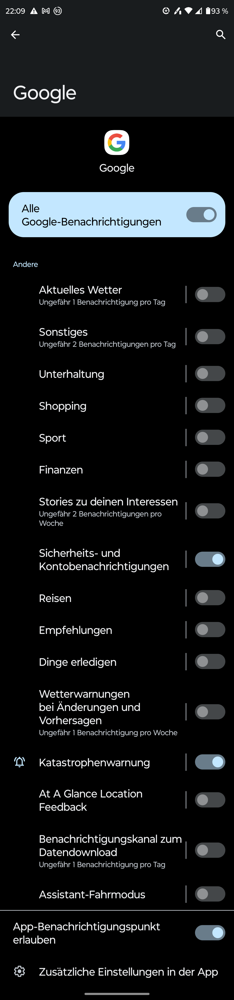

- Android - General
    - How to change the system font style to a custom one, for example to a monospaced font?

    - Compatible USB Type-C adapter to 3.5mm audio jack?

    - MacroDroid - further scripts
        - Play sound when switching to mobile data
            - https://duckduckgo.com/?q=macrodroid+mobile+data
            - https://duckduckgo.com/?q=macrodroid+mobile+data+adb&ia=web
            - https://www.reddit.com/r/macrodroid/comments/ucln0l/mobile_data_toggle_does_not_work_despite_adb_hack/
                - `adb shell pm grant com.arlosoft.macrodroid android.permission.WRITE_SECURE_SETTINGS`
        - Blink flashlight on incoming call
        - Make screenshot with delay via persistent notification

    - Custom app development
        - Disable/hide notification panel/status bar on lock screen
            - https://duckduckgo.com/?q=lock+disable+notification+panel+control+on+lock+screen&ia=web
            - https://forum.xda-developers.com/t/how-to-disable-drop-down-notification-panel-on-lockscreen.3910909/
                - on Samsung devices enable `Lock network and security` in `Settings -> Lock Screen -> Secure lock settings`
                - on stock Android only allows only hiding the notifications (`Settings -> Display -> Lockscreen -> Data protection: No notifications`), but the control panel is still available and accessible
            - https://forum.xda-developers.com/t/how-to-disable-access-to-the-notification-bar-while-in-the-lock-screen.3838611/
            - https://duckduckgo.com/?q=hide+remove+disable+notification+status+bar+android&ia=web
            - https://stackoverflow.com/questions/34581565/android-hide-disable-notification-status-bar
                - app with `android.permission.SYSTEM_ALERT_WINDOW` and overriden `onInterceptTouchEvent` on custom ViewGroup
            - https://forum.xda-developers.com/t/guide-no-root-required-hide-the-status-bar-or-nav-bar-with-adb.3654807/
                - hide status bar: `adb shell settings put global policy_control immersive.status=*`
                - show status bar: `adb shell settings put global policy_control null*`
            - https://stackoverflow.com/questions/4222713/hide-notification-bar
                - https://stackoverflow.com/questions/4222713/hide-notification-bar/19902500#19902500
        - Protect power menu with authentication
            - https://duckduckgo.com/?q=android+require+verification+before+shutdown&ia=web
            - https://support.google.com/work/android/thread/94860452/how-do-i-set-up-a-password-when-switching-off-my-android-phone-to-avoid-theft?hl=en
            - https://www.quora.com/How-do-I-set-up-a-password-when-switching-off-my-android-phone-to-avoid-theft?share=1
            - **Smart Lockscreen Protector** didn't protected the notification/status bar from being pulled down and enable/disable settings via quick shortcuts, like enabling airplane mode, disabling wifi, mobile data, bluetooth etc.
            - https://stackoverflow.com/questions/11907205/password-required-to-power-off-android-device
                - `android.intent.action.SHUTDOWN`
            - https://duckduckgo.com/?q=android.intent.action.SHUTDOWN&ia=web
            - https://stackoverflow.com/questions/34102139/how-to-make-action-shutdown-intent-work-when-app-is-closed-in-android
                - `android.permission.DEVICE_POWER`
                - `android.intent.action.ACTION_SHUTDOWN`
            - https://www.demo2s.com/android/android-intent-action-shutdown.html
            - https://duckduckgo.com/?q=difference+action_reboot+action_shutdown&ia=web
            - https://stackoverflow.com/questions/17917858/difference-between-intent-action-reboot-and-intent-action-shutdown
            - https://developer.android.com/reference/android/content/Intent.html#ACTION_SHUTDOWN
            - https://developer.android.com/reference/android/content/Intent#ACTION_REBOOT

- Settings screenshots

    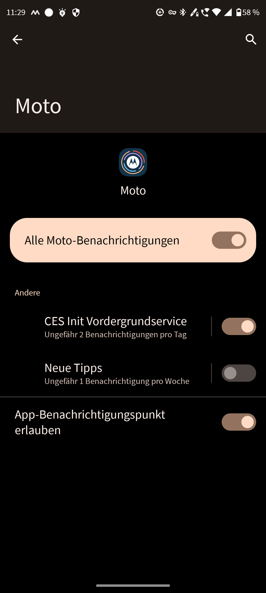
    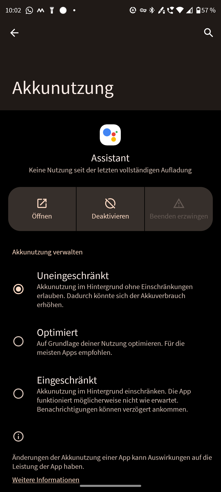

    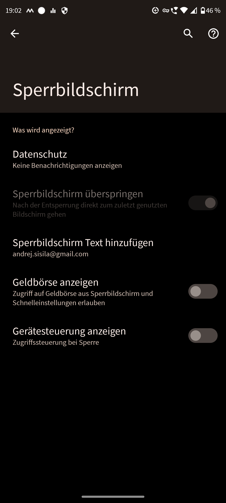

    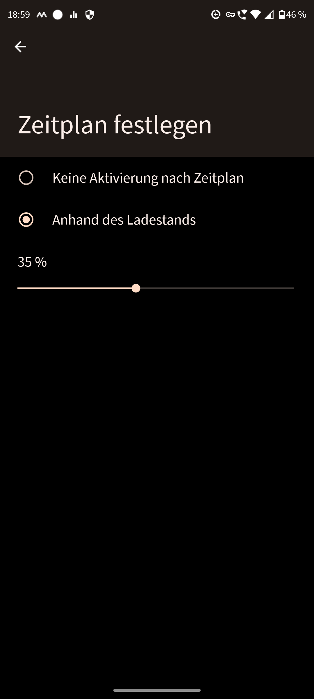

    ---

    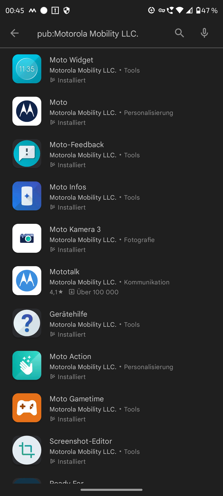
    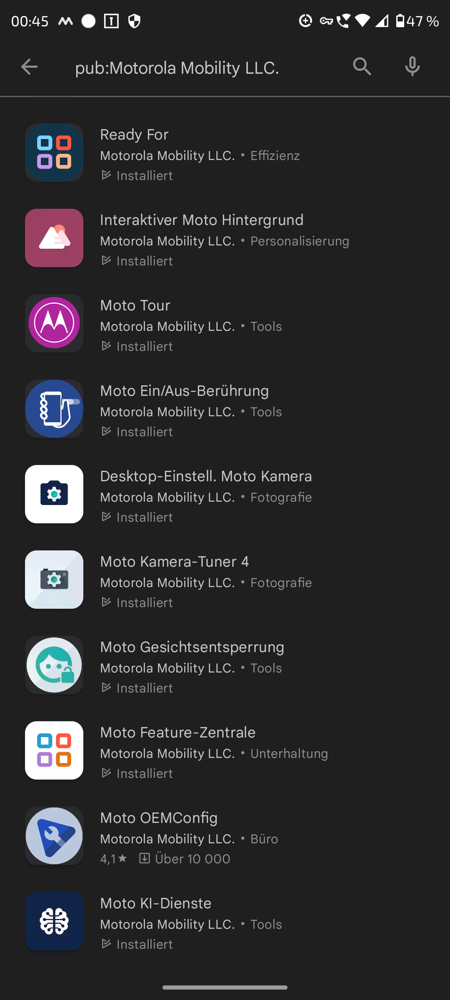

    ---

    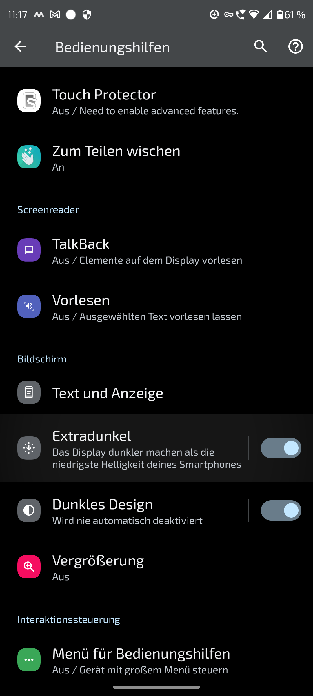
    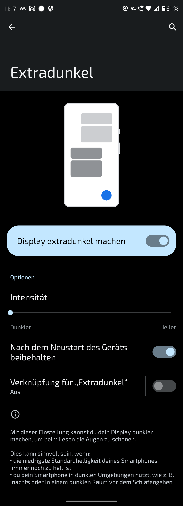

    ---

    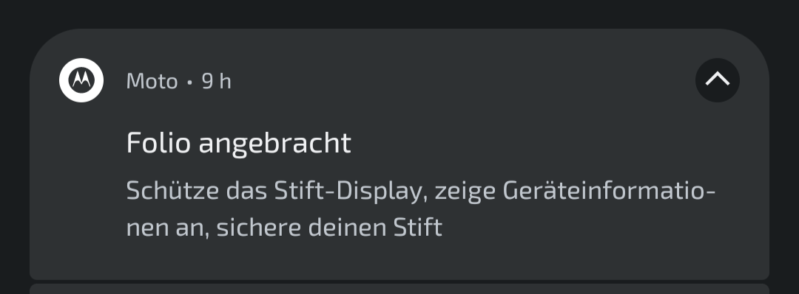
    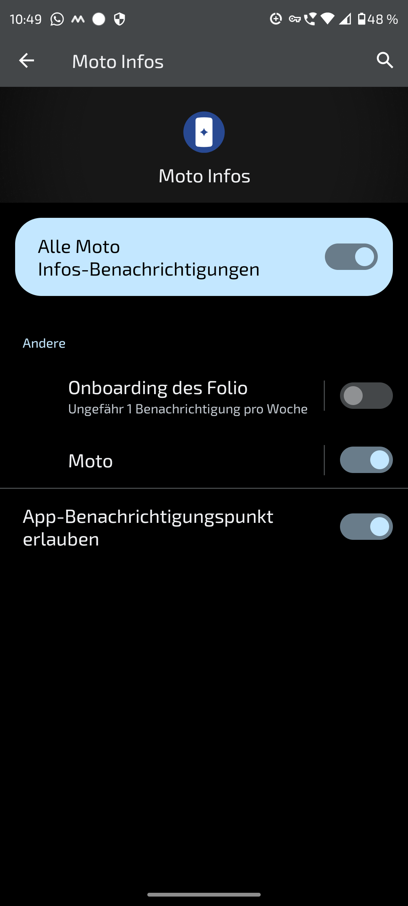

    ---

    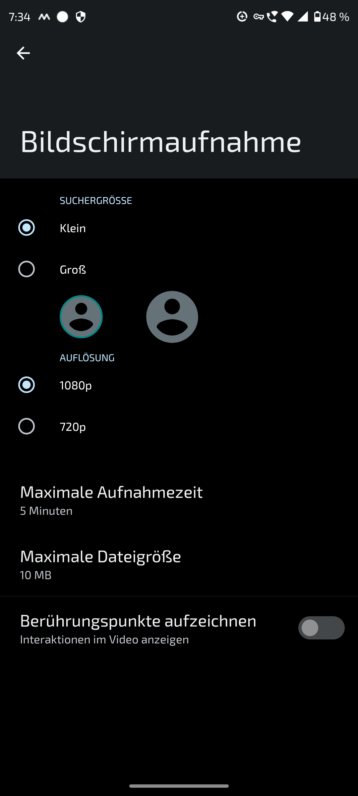

    ---

    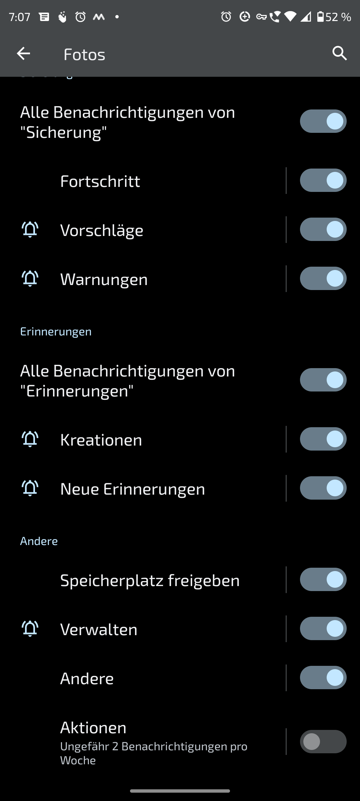
    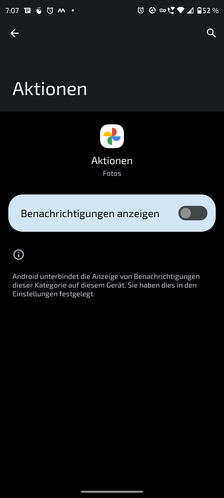

    ---

    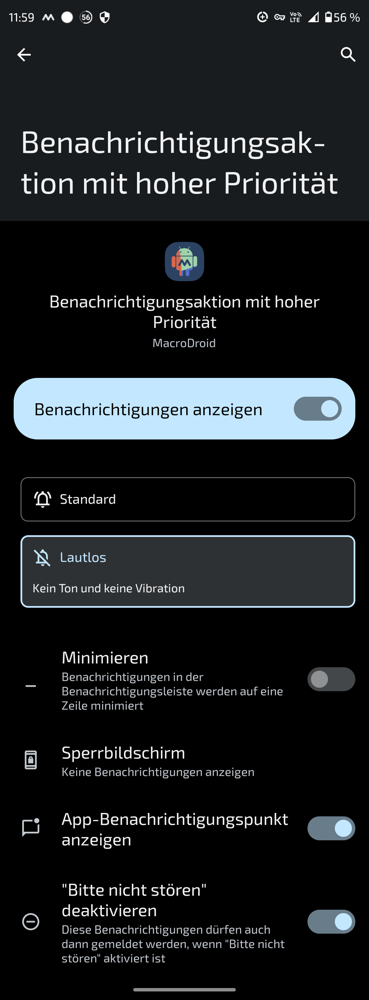
    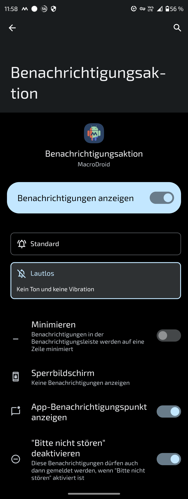

    ---
    
    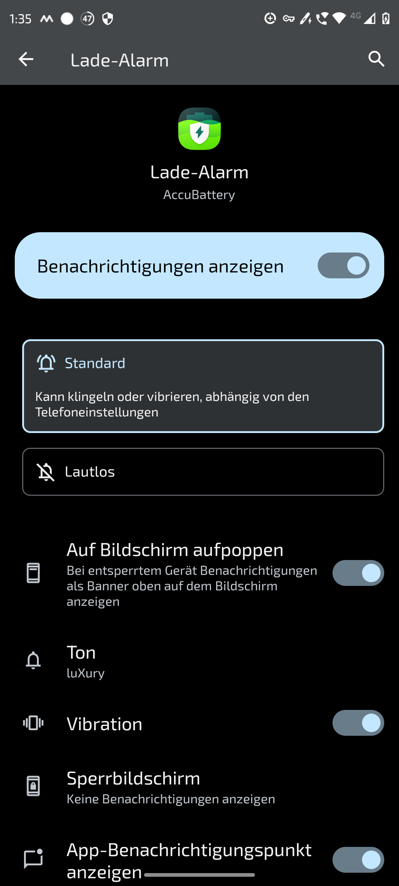

    ---

    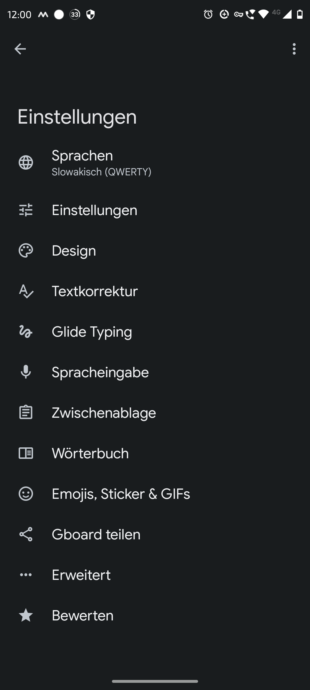
    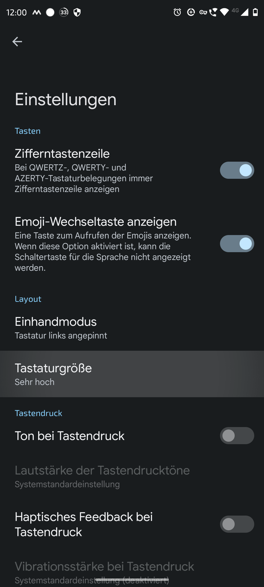
    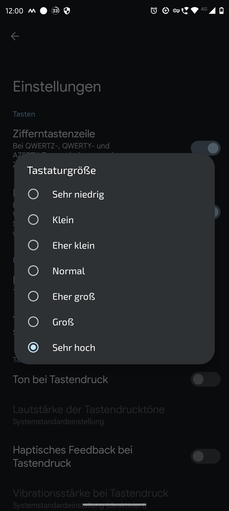

    ---

- Motorola Edge 30 Pro with Android 12 - device specific tweaks and workarounds:
    - Fix randomly occurring 1-2 minutes durating audio crackling: noisy and distorted sound (then the sound plays well)
        - After further investigation I noticed, that this audio distortions are related only to mobile and desktop versions of the Soundcloud webpage. **The solution was to stop using the Soundcloud webpages and play music from the dedicated Soundcloud app.**    

    - Fix for getting stuck on the Peek Display
        - vypnut peek display, lebo raz mi telefon vobec nesiel odblokovat a zostal zaseknuty na peek displayi. ani na tlacidlo zapinania nereagoval, aby som hi restartoval. zachranil ma az folio display, kde zapinacie tlacidlo otvorilo ponuku a cez folio kryt so telefom restartoval. potom telefon nabehol v pohode. asi zblbol preto, lebo uz mal iny obal nez folio.

    - Is there any way to customize the Folio display? The clock sometimes takes two rows on the Folio display instead of one and overlaps the edge of the folio cutout when closed, because it doesn't fit the Folio display area when the Folio cover is closed.
        - Workaround for clock on the Folio display: disable the `Automatic time format` and `24-hour format`

            Change this:
            
            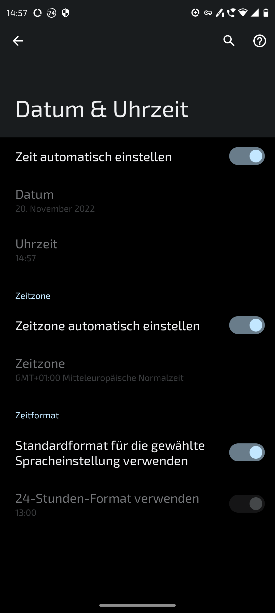

            To this:

            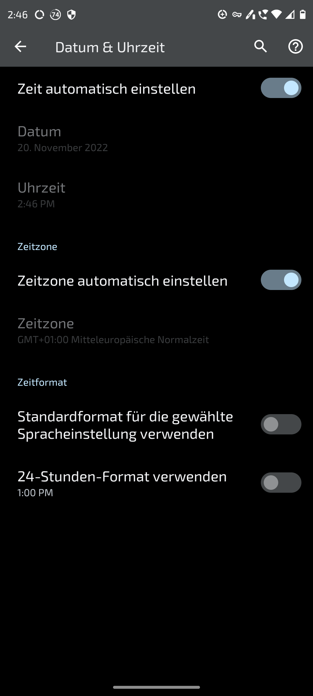

    - poexperimentovat s nastaveniami always on displeja s appkou Always On: Edge Music Lightning
        - bez zmeny na Folio displeji
        - The Folio display can be used as is without any customizations. Either use it as is or turn it off.
